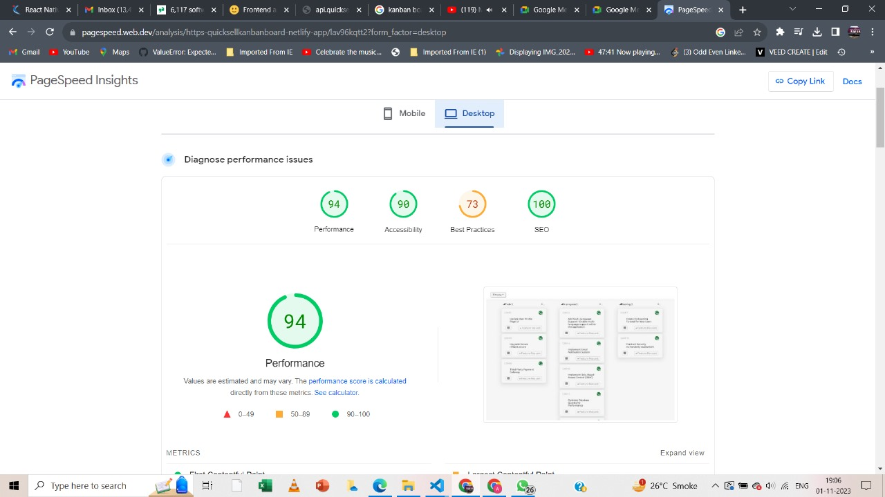

# 💻 REACT Kanban board quicksell

## 📚 Description

The Kanban board should be responsive and visually appealing, with a design similar to the provided screenshots. 

**The priority levels for the tickets are as follows:**

- Urgent (Priority level 4)
- High (Priority level 3)
- Medium (Priority level 2)
- Low (Priority level 1)
- No priority (Priority level 0)

**Priority levels: (This values you will receive in the api)**

4 - Urgent

3 - High

2 - Medium

1 - Low

0 - No priority
## 👨‍💻 Live Demo

Try out the website : [REACT kanban board](https://quicksellkanbanboard.netlify.app/)

##  Tech Stack

##  Dependencies

- **_react-redux**
- **_react-icon**
- **_react-fetch**
- **_react-hot-toast_**

  

## 👨‍💻 Features

The application should offer three distinct ways to group the data:

1. **By Status**: Group tickets based on their current status.
2. **By User**: Arrange tickets according to the assigned user.
3. **By Priority**: Group tickets based on their priority level.

Users should also be able to sort the displayed tickets in two ways:

1. **Priority**: Arrange tickets in descending order of priority.
2. **Title**: Sort tickets in ascending order based on their title.
## ✍️ Predefined SQL Queries

## ⏱ Page Load Time

Page Load time of this website in desktop is in the range of 0.2 s to 0.5s.
speed index-0.9s total blocking time 0 s
we can check code spnappyness GTmetrix Grade.

### [web.dev Report](https://pagespeed.web.dev/)

Laptop performance view

Mobile performance view

## 🪜 Steps I took to optimize the page load time

- Used Lighthouse DevTools Extension to find the performance issues and fix them using their actionable suggestion.
- Used vercel to deploy this website.

## Available Scripts

In the project directory, you can run:

### `npm install`

To install all the packages in package.json. This will install all the dependencies and devDependencies.

### `npm start`

Runs the app in the development mode.\
Open [http://localhost:3000](http://localhost:3000) to view it in the browser.

The page will reload if you make edits.\
You will also see any lint errors in the console.

### `npm run build`

Builds the app for production to the `build` folder.\
It correctly bundles React in production mode and optimizes the build for the best performance.

The build is minified and the filenames include the hashes.\
Your app is ready to be deployed!

See the section about [deployment](https://facebook.github.io/create-react-app/docs/deployment) for more information.

## 🚀 Project Output

.jpg)
.jpg)
